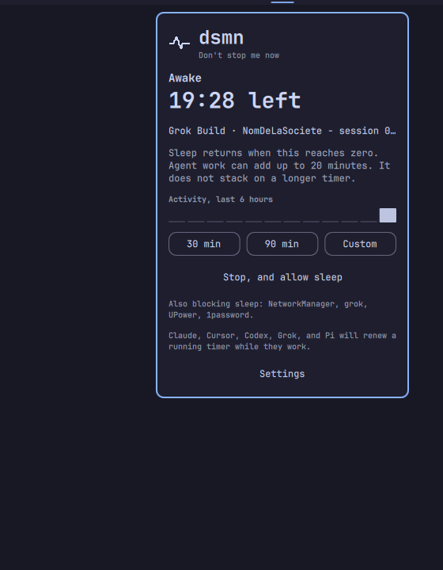

# dsmn



Don't stop me now.

dsmn keeps an Omarchy machine awake while a lease is running, then lets it sleep when the work stops. The pulse sits in the bar with the time left beside it. Open it for the timer. Settings is where the hooks and the bar position live.

Free. No account. MIT.

## Install

```bash
omarchy plugin add https://github.com/nomdelasociete/omarchy-dsmn.git --enable
```

This clones the repository into `~/.config/omarchy/plugins/nomdelasociete.dsmn/` and puts the widget on the bar. It does not install agent hooks and it does not change sleep settings.

Plugins run unsandboxed inside `omarchy-shell`, as you. Read this repository before you enable it.

## Remove

Open dsmn, choose Settings, and remove the hooks if you installed them. Then:

```bash
omarchy plugin remove nomdelasociete.dsmn
```

That disables the plugin and deletes the checkout. It does not delete `~/.local/state/dsmn/` or a logind drop-in you confirmed by hand. Remove those yourself if you want them gone:

```bash
rm -f ~/.local/bin/dsmn
rm -rf ~/.local/state/dsmn
sudo rm -f /etc/systemd/logind.conf.d/nomdelasociete-dsmn-lid.conf
sudo systemctl reload systemd-logind
```

## What you can do

- Start a timer for 30 minutes, 90 minutes, or a custom length up to 8 hours.
- Stop it. Sleep is allowed again.
- Let Claude Code, Cursor, Codex, Grok, and Pi renew a running timer while they work. A renewal never stacks and never shortens a longer timer.
- See who last renewed it, the last six hours of activity, and who else is blocking sleep.
- Move the icon to the left, center, or right of the bar.
- Show or hide the countdown next to the icon.

The screen can still blank and the session can still lock. dsmn blocks sleep, not the display.

## What it touches

Only after you ask:

| Action | Where |
|---|---|
| Settings → Install hooks | `~/.claude/settings.json`, `~/.cursor/hooks.json`, `~/.codex/config.toml`, `~/.codex/hooks.json`, `~/.grok/hooks/dsmn.json`, `~/.pi/agent/extensions/dsmn.ts` |
| Settings → Install hooks | symlink `~/.local/bin/dsmn` |
| Settings → Let a closed lid obey the timer | `/etc/systemd/logind.conf.d/nomdelasociete-dsmn-lid.conf`, after sudo in a terminal you can see |

Always, while the plugin is enabled:

| What | Where |
|---|---|
| Lease | `~/.local/state/dsmn/state.json` |
| Sleep lock | a `systemd-inhibit` process. It exits when the lease ends |

The lock is released when the timer ends, you press Stop, the lease reaches 8 hours, the battery is at or below 20% while unplugged, or there has been no network route for 15 minutes.

## Update

```bash
omarchy plugin update nomdelasociete.dsmn
```

Omarchy shows the diff before it applies.

## Requirements

Omarchy with shell plugins, `systemd-inhibit`, `python3`, and `busctl`. No extra packages.

## License

MIT.
